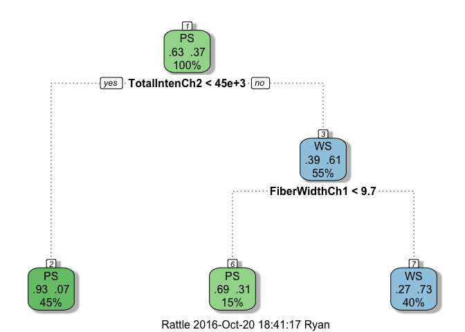

Ryan Tillis - Machine Learning - Data Science - Quiz 3 - Coursera
================
<a href="http://www.ryantillis.com"> Ryan Tillis </a>
August 14, 2016

Machine Learning Quiz 3
-----------------------

This is Quiz 3 from the Machine Learning course within the Data Science Specialization. This is intended as a learning resource. Topics include Random Forests, CART, k-fold cross validation, bias and olive oil.

### Questions

<hr>
<font size="+2">1. </font> Load the Alzheimer's disease data using the commands:

``` r
library(AppliedPredictiveModeling)
data(segmentationOriginal)
library(caret)
```

    ## Loading required package: lattice

    ## Loading required package: ggplot2

1.  Subset the data to a training set and testing set based on the Case variable in the data set.

2.  Set the seed to 125 and fit a CART model with the rpart method using all predictor variables and default caret settings.

3.  In the final model what would be the final model prediction for cases with the following variable values:

<!-- -->

1.  TotalIntench2 = 23,000; FiberWidthCh1 = 10; PerimStatusCh1=2

2.  TotalIntench2 = 50,000; FiberWidthCh1 = 10;VarIntenCh4 = 100

3.  TotalIntench2 = 57,000; FiberWidthCh1 = 8;VarIntenCh4 = 100

4.  FiberWidthCh1 = 8;VarIntenCh4 = 100; PerimStatusCh1=2

<hr>
<font size="+1"><b>a. PS

1.  WS

2.  PS

3.  Not possible to predict </b> </font>

``` r
library(AppliedPredictiveModeling)
data(segmentationOriginal)
library(caret)
```

</font>

<hr>
##### Explanation:

Split the data by test/train factor then fit to a CART model and evaluated the nodes.

<hr>
<font size="+2">2. </font> If K is small in a K-fold cross validation is the bias in the estimate of out-of-sample (test set) accuracy smaller or bigger? If K is small is the variance in the estimate of out-of-sample (test set) accuracy smaller or bigger. Is K large or small in leave one out cross validation?

``` r
library(AppliedPredictiveModeling)
data(segmentationOriginal)
library(caret)

set.seed(125)
trainset <- segmentationOriginal[which(segmentationOriginal$Case == "Train"),]
testset <- segmentationOriginal[which(segmentationOriginal$Case == "Test"),]

#Fitting the CART model with caret package
modFit <- train(Class ~., method ="rpart", data=trainset)
print(modFit$finalModel)
```

    ## n= 1009 
    ## 
    ## node), split, n, loss, yval, (yprob)
    ##       * denotes terminal node
    ## 
    ## 1) root 1009 373 PS (0.63032706 0.36967294)  
    ##   2) TotalIntenCh2< 45323.5 454  34 PS (0.92511013 0.07488987) *
    ##   3) TotalIntenCh2>=45323.5 555 216 WS (0.38918919 0.61081081)  
    ##     6) FiberWidthCh1< 9.673245 154  47 PS (0.69480519 0.30519481) *
    ##     7) FiberWidthCh1>=9.673245 401 109 WS (0.27182045 0.72817955) *

    ## Loading required package: rattle

    ## Rattle: A free graphical interface for data mining with R.
    ## Version 4.1.0 Copyright (c) 2006-2015 Togaware Pty Ltd.
    ## Type 'rattle()' to shake, rattle, and roll your data.

    ## Loading required package: rpart.plot



<hr>
-   <font size="+1">**The bias is larger and the variance is smaller. Under leave one out cross validation K is equal to the sample size.**</font>

<hr>
##### Explanation:

<hr>
<font size="+2">3. </font> Load the olive oil data using the commands:

``` r
require(pgmm)
data(olive)
olive = olive[,-1]
```

(NOTE: If you have trouble installing the pgmm package, you can download the -code-olive-/code- dataset here: olive\_data.zip. After unzipping the archive, you can load the file using the -code-load()-/code- function in R.)

These data contain information on 572 different Italian olive oils from multiple regions in Italy. Fit a classification tree where Area is the outcome variable. Then predict the value of area for the following data frame using the tree command with all defaults

``` r
newdata = as.data.frame(t(colMeans(olive)))
```

<hr>
-   <font size="+1"> **2.783. It is strange because Area should be a qualitative variable - but tree is reporting the average value of Area as a numeric variable in the leaf predicted for newdata**

</font>

##### Explanation:

<hr>
``` r
modFit2 <- train(Area ~., method ="rpart", data=olive)
```

    ## Warning in nominalTrainWorkflow(x = x, y = y, wts = weights, info =
    ## trainInfo, : There were missing values in resampled performance measures.

``` r
print(modFit2$finalModel)
```

    ## n= 572 
    ## 
    ## node), split, n, deviance, yval
    ##       * denotes terminal node
    ## 
    ## 1) root 572 3171.32000 4.599650  
    ##   2) Eicosenoic>=6.5 323  176.82970 2.783282 *
    ##   3) Eicosenoic< 6.5 249  546.51410 6.955823  
    ##     6) Linoleic>=1053.5 98   21.88776 5.336735 *
    ##     7) Linoleic< 1053.5 151  100.99340 8.006623 *

``` r
fancyRpartPlot(modFit2$finalModel)
```


``` r
predict(modFit2,newdata)
```

    ##        1 
    ## 2.783282

<hr>
<font size="+2">4. </font> Load the South Africa Heart Disease Data and create training and test sets with the following code:

``` r
library(ElemStatLearn)
data(SAheart)
set.seed(8484)
train = sample(1:dim(SAheart)[1],size=dim(SAheart)[1]/2,replace=F)
trainSA = SAheart[train,]
testSA = SAheart[-train,]
```

Then set the seed to 13234 and fit a logistic regression model (method="glm", be sure to specify family="binomial") with Coronary Heart Disease (chd) as the outcome and age at onset, current alcohol consumption, obesity levels, cumulative tabacco, type-A behavior, and low density lipoprotein cholesterol as predictors. Calculate the misclassification rate for your model using this function and a prediction on the "response" scale:

<hr>
-   <font size="+1">\*\*Test Set Misclassification: 0.31

Training Set: 0.27\*\* </font>

<hr>
##### Explanation:

``` r
set.seed(13234)
head(trainSA)
```

    ##     sbp tobacco  ldl adiposity famhist typea obesity alcohol age chd
    ## 238 176    5.76 4.89     26.10 Present    46   27.30   19.44  57   0
    ## 114 174    0.00 8.46     35.10 Present    35   25.27    0.00  61   1
    ## 312 174    3.50 5.26     21.97 Present    36   22.04    8.33  59   1
    ## 301 166    4.10 4.00     34.30 Present    32   29.51    8.23  53   0
    ## 311 130    0.05 2.44     28.25 Present    67   30.86   40.32  34   0
    ## 179 128    0.04 8.22     28.17  Absent    65   26.24   11.73  24   0

``` r
#Fitting the Binomial model
modFit3 <- train(chd ~age + alcohol + obesity + tobacco + typea + ldl, method ="glm", family = "binomial", data=trainSA)
```

    ## Warning in train.default(x, y, weights = w, ...): You are trying to do
    ## regression and your outcome only has two possible values Are you trying to
    ## do classification? If so, use a 2 level factor as your outcome column.

``` r
#Missclassification function
missClass = function(values,prediction){sum(((prediction > 0.5)*1) != values)/length(values)}

#Predicting against test and training sets
predTest <- predict(modFit3,testSA)
predTrain <- predict(modFit3,trainSA)

tabletest <- table(predTest>0.5, testSA$chd)
tabletrain <- table(predTrain>0.5,testSA$chd)

#Misclassification for each model and tables
missClass(testSA$chd, predTest)
```

    ## [1] 0.3116883

``` r
missClass(trainSA$chd,predTrain)
```

    ## [1] 0.2727273

``` r
tabletest
```

    ##        
    ##           0   1
    ##   FALSE 117  34
    ##   TRUE   38  42

``` r
tabletrain
```

    ##        
    ##           0   1
    ##   FALSE 107  57
    ##   TRUE   48  19

<hr>
<font size="+2">5. </font> Load the vowel.train and vowel.test data sets:

``` r
library(ElemStatLearn)
data(vowel.train)
data(vowel.test)
```

Set the variable y to be a factor variable in both the training and test set. Then set the seed to 33833. Fit a random forest predictor relating the factor variable y to the remaining variables. Read about variable importance in random forests here: <http://www.stat.berkeley.edu/~breiman/RandomForests/cc_home.htm#ooberr> The caret package uses by default the Gini importance.

Calculate the variable importance using the varImp function in the caret package. What is the order of variable importance?

<hr>
-   <font size="+1"> \*\*The order of the variables is:

x.2, x.1, x.5, x.6, x.8, x.4, x.9, x.3, x.7,x.10** **PCA Accuracy: 0.72\*\* </font>

<hr>
##### Explanation:

Results aren't exactly the same as the quiz but the algorithm for random forest has changed in the caret package since the quiz was made. At least the first 5 most important variables are the same.

``` r
set.seed(33833)

test <- vowel.test
test$y <- factor(test$y)
train <- vowel.train
train$y <- factor(train$y)

modfit4 <- train(y ~., method = "rf", data = train)
```

    ## Loading required package: randomForest

    ## randomForest 4.6-12

    ## Type rfNews() to see new features/changes/bug fixes.

    ## 
    ## Attaching package: 'randomForest'

    ## The following object is masked from 'package:ggplot2':
    ## 
    ##     margin

``` r
varImp(modfit4)
```

    ## rf variable importance
    ## 
    ##       Overall
    ## x.1  100.0000
    ## x.2   98.5960
    ## x.5   44.3214
    ## x.6   28.3926
    ## x.8   14.9865
    ## x.9    6.7483
    ## x.3    4.8055
    ## x.4    4.5061
    ## x.7    0.5042
    ## x.10   0.0000

<hr>
Check out my website at: <http://www.ryantillis.com/>

<hr>
